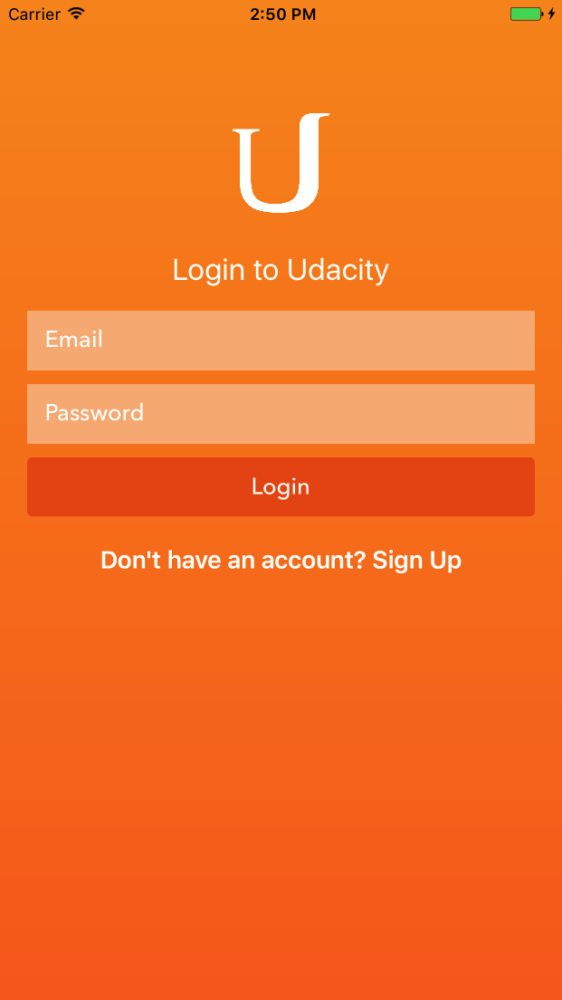
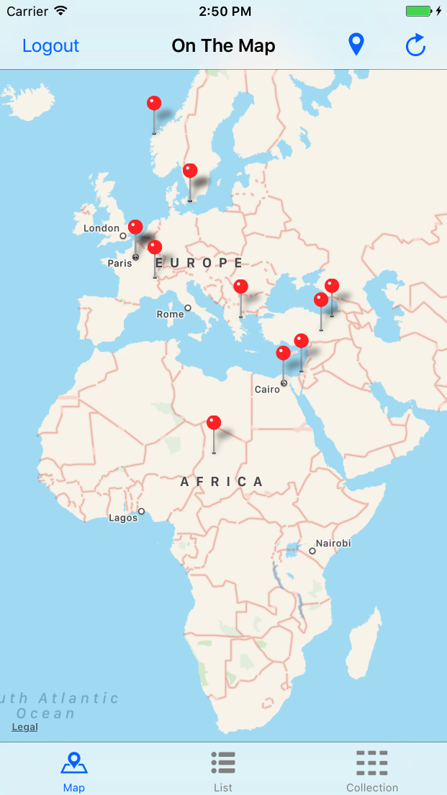
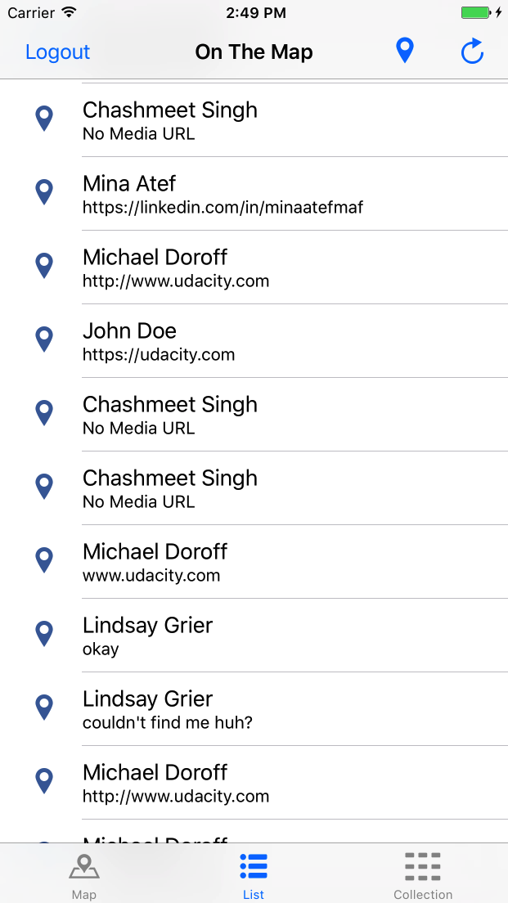
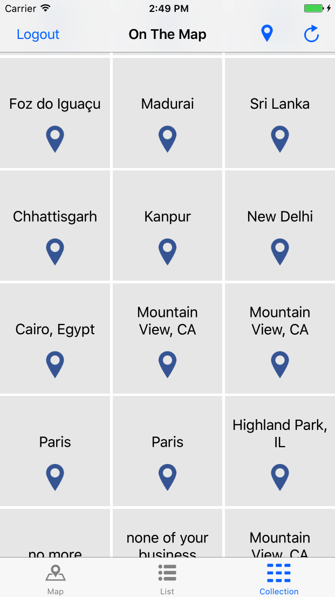
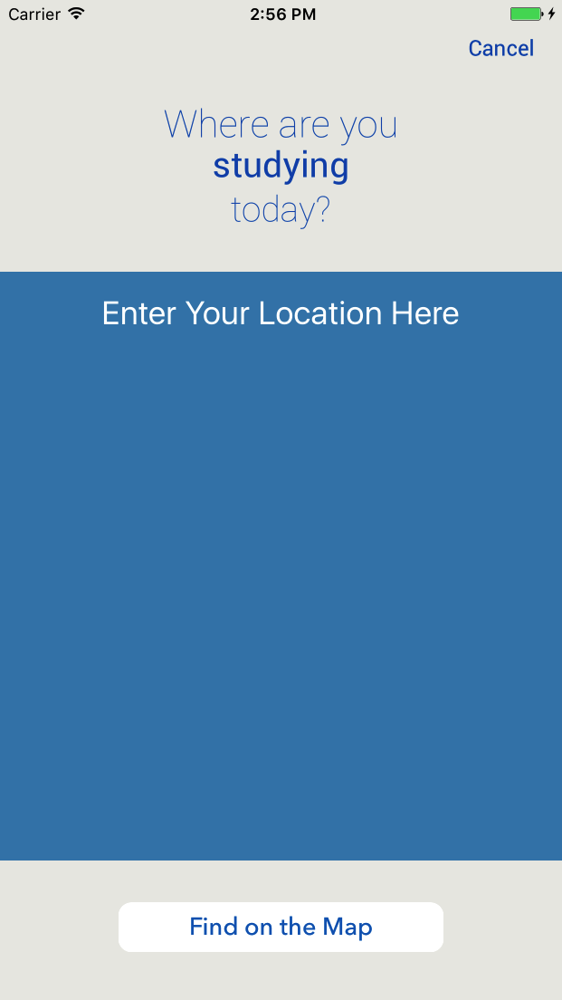
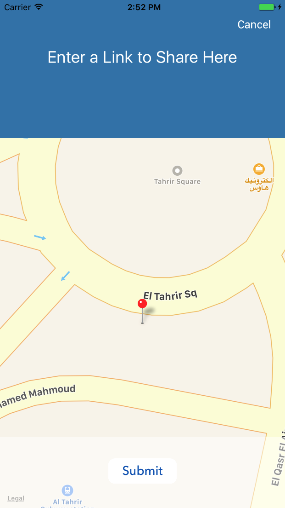
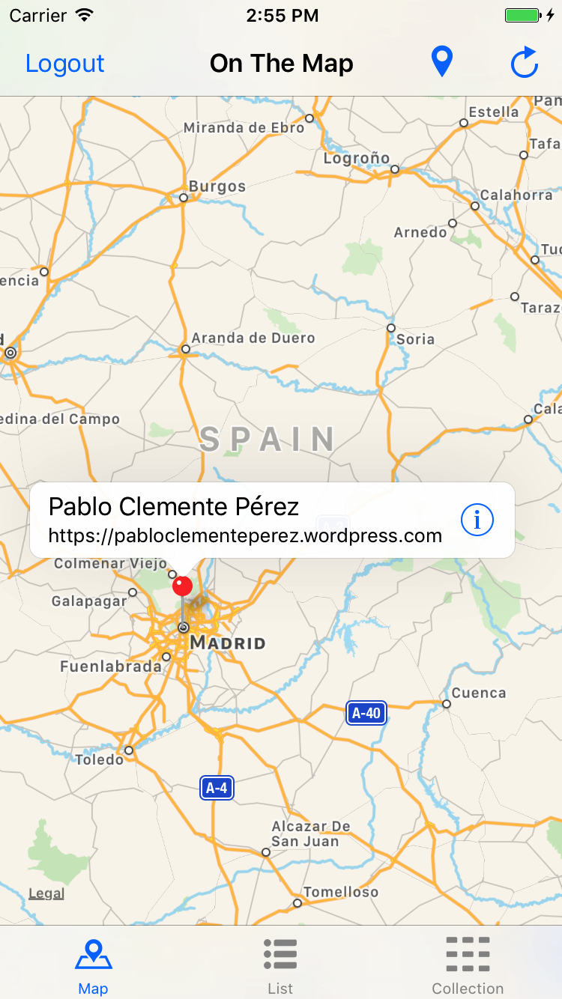

# On The Map
This iOS app posts user-generated location information to a shared map, pulling the locations of fellow Nanodegree students, with custom messages about themselves or their learning experience.

## Overview
The app starts by logging the user into their [Udacity](https://www.udacity.com/) account, where they can post some link pointing to something about themselves in some location they specify. And can then navigate the map to check other posts by fellow students. The user can then visit the link specified by the other students, and can check the same information in a table view or in a collection view (by the map location).

## Setup
In order to use/test this app, you'll need to have a [Udacity account](https://auth.udacity.com/sign-up?next=https%3A%2F%2Fclassroom.udacity.com%2Fauthenticated). Check it out, you'll find a lot of interesting stuff there. You'll be amazed.

## Screenshots
       

## License
See [LICENSE](LICENSE)
